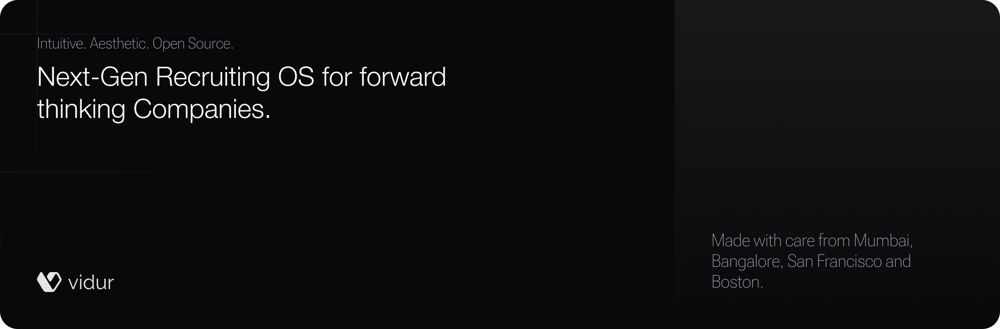

Vidur is an open-source, next-gen Recruiting OS. Its intuitive interface combines AI-powered search, advanced candidate profiles, and one-click apply features, enabling forward-thinking companies to efficiently manage their recruitment processes from start to finish.