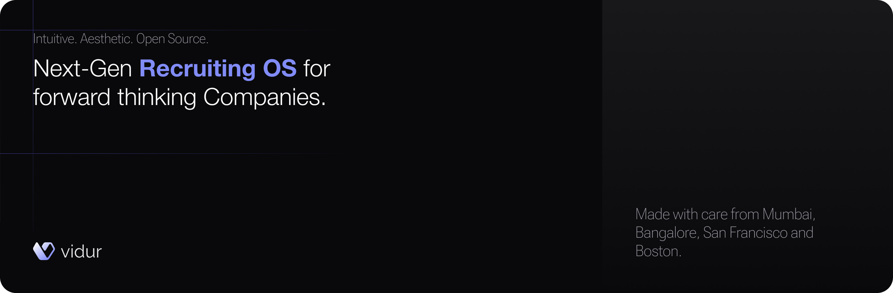
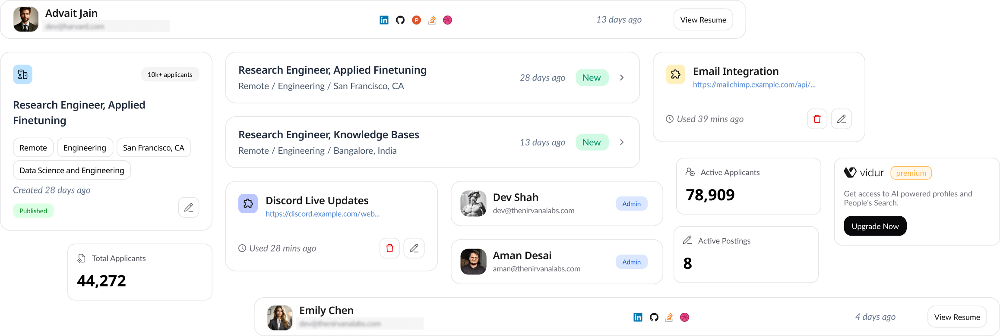
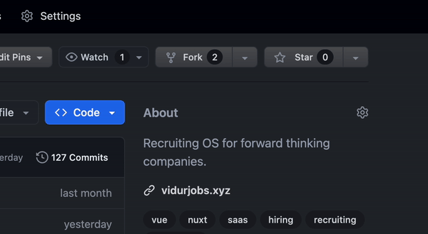

> ##  🚧 WIP<br>
> ### This project is under active development and might include breaking changes.
> See open issues to become an early contributor.

<p align="center">
  <a href="https://github.com/nirvanaOSS/vidur">
   
  </a>

  <h3 align="center">Vidur (powered by ProfileCity)</h3>

  <p align="center">
    The open-source next-gen Recruiting OS.
    <br />
    <a href="https://www.vidurjobs.xyz"><strong>Learn more »</strong></a>
    <br />
    <br />
    <a href="https://discord.gg/Pt2W9Sx7ap">Discord</a>
    ·
    <a href="https://www.vidurjobs.xyz">Website</a>
    ·
    <a href="https://github.com/nirvanaOSS/vidur/issues">Issues</a>
    ·
    <a href="https://www.vidurjobs.xyz/roadmap">Roadmap</a>
  </p>
</p>

<p align="center">
   <a href="https://x.com/thenirvanalabs"></a>
   <a href="https://discord.gg/Pt2W9Sx7ap"></a>
   <a href="https://www.linkedin.com/company/thenirvanalabs"></a>
   <a href="https://www.producthunt.com/products/vidur"></a>
</p>

# Recruiting OS for forward thinking companies
Vidur is an open-source, next-gen Recruiting OS. Its intuitive and modern interface combines advanced candidate profiles, team workspace, plugins,  one-click apply features, and a lot more enabling forward-thinking companies to efficiently manage their recruitment processes from start to finish.



## Development Setup
```sh
# Requirements: A PostgreSQL instance up-and-running.
# Clone the repo and cd into the folder.
npm i -g yarn         # install yarn package manager, if you don't have already.
yarn                  # install all the dependencies
cp .env.example .env  # Create env file and fill the fields. (DO NOT CHANGE PORT)
yarn migration:apply  # Create database schema.
yarn dev              # Finally, start the dev server.
```

### Commands to Run Via Docker 

  **Run the Development Environment:**

   ```bash
   docker compose --profile dev up 
   ```

   This command starts the `db` and `app` services using the `dev` profile. It runs PostgreSQL as `database` and the app as `vidur_app`.service mounts your local code into the container, enabling real-time updates without rebuilding. Changes in your code are automatically reflected in the running application.

## Contributing
There are several ways to start contributing to Vidur. See [contribution guide](./CONTRIBUTING.md) to get started.

## Staying ahead
Star Vidur on GitHub and be instantly notified of new releases.


## Security disclosure
To protect your privacy, please avoid posting security issues on GitHub. Instead, send your questions to team@vidurjobs.xyz and we will provide you with a more detailed answer.
